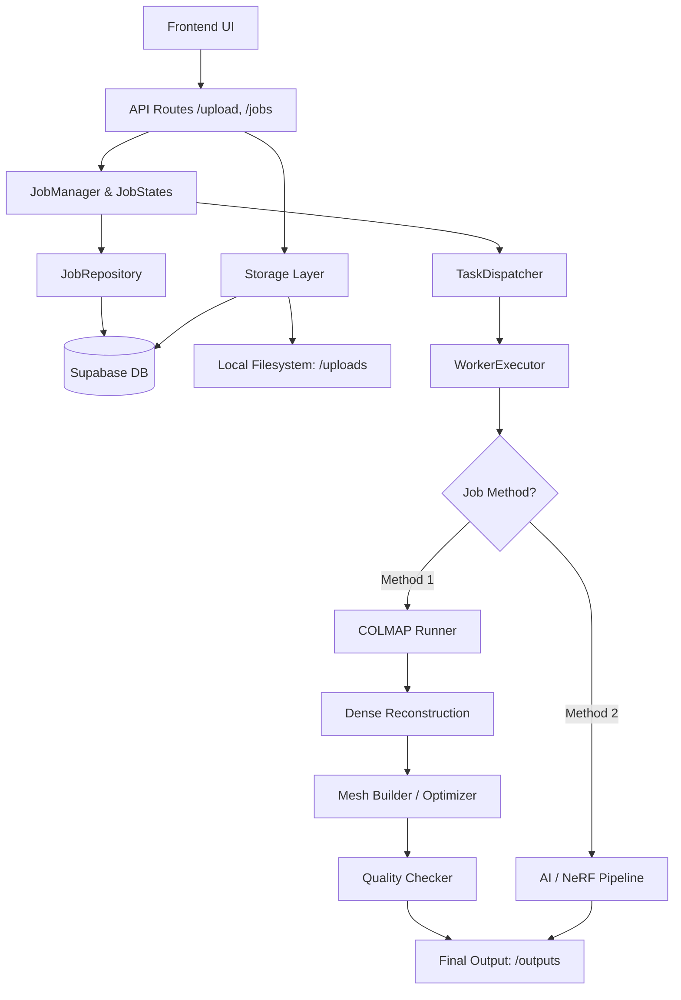

Here is a detailed, structured `README.md` for your ORCA backend project, heavily inspired by the architectural depth and professional tone of the OSM example you provided. You can copy and paste this directly into your repository.

***

# ORCA - Object Reconstruction via Computational AI (Backend)

Welcome to the backend repository for **ORCA** (Object Reconstruction via Computational AI). This FastAPI-based backend is designed to manage and orchestrate heavy 3D reconstruction pipelines, transforming 2D image sets into optimized, high-fidelity 3D meshes.

---

## Installation and Running the Backend

### 1. Clone the repository

```bash
git clone https://github.com/saikoushik08/saikoushik08-orca-backend.git
cd saikoushik08-orca-backend
```

### 2. Create and activate a virtual environment

#### Windows (PowerShell)

```powershell
python -m venv .venv
.\.venv\Scripts\Activate.ps1
```

#### Windows (CMD)

```cmd
python -m venv .venv
.venv\Scripts\activate
```

#### macOS / Linux

```bash
python3 -m venv .venv
source .venv/bin/activate
```

### 3. Install dependencies

```bash
pip install -r requirements.txt
```

### 4. Install External Dependencies (COLMAP)

This backend relies on **COLMAP** for classical photogrammetry (Method 1). 
* Download and install COLMAP with CUDA support.
* Ensure the executable is located at (or update `colmap_runner.py` to match):
    `C:\Program Files\colmap-x64-windows-cuda\bin\colmap.exe`

### 5. Configure environment variables

Create a `.env` file in the project root and add the required Supabase credentials for cloud storage and database tracking.

```env
SUPABASE_URL=your_supabase_project_url
SUPABASE_SERVICE_KEY=your_supabase_service_role_key
```

### 6. Run the backend server

```bash
uvicorn app.main:app --reload
```

The backend will start at:

```text
http://127.0.0.1:8000
```

### 7. Open the API documentation

Swagger UI:

```text
http://127.0.0.1:8000/docs
```

ReDoc:

```text
http://127.0.0.1:8000/redoc
```

---

# Final backend design principles

## 1. Strict State Machine Orchestration

The backend manages long-running 3D reconstruction jobs using a strict, enforced lifecycle:
`CREATED` ➔ `UPLOADING` ➔ `PENDING` ➔ `PROCESSING` ➔ `COMPLETED` / `FAILED`.
State transitions are centrally controlled by a `JobManager` to prevent race conditions during heavy processing.

## 2. Decoupled Worker Execution

3D reconstruction is computationally expensive. The backend API handles routing, upload limits, and database state, but delegates the actual execution to a `WorkerExecutor` and `TaskDispatcher`. This allows the API to remain responsive while heavy COLMAP or AI tasks run locally in dedicated workspaces.

## 3. Hybrid Reconstruction Engine

The architecture is built to support multiple reconstruction paradigms seamlessly:
* **Method 1 (Classical Photogrammetry):** A fully realized pipeline wrapping COLMAP (SfM, PatchMatch, Poisson meshing).
* **Method 2 (AI/NeRF):** Stubbed architecture prepared for deep-learning-based view synthesis, point cloud extraction, and texture baking.

## 4. Intelligent Mesh Fallbacks & Optimization

The system doesn't just output raw data; it intelligently processes it. The `MeshBuilder` applies conditional logic based on mesh size:
* Removes small, noisy floating components.
* Extracts the largest watertight component.
* Applies Taubin smoothing.
* Performs quadric decimation for massive meshes.
* *Fallback logic:* If dense meshing fails, it automatically reverts to ball-pivoting reconstruction using the fused point cloud.

## 5. Cloud-Local Storage Synchronization

Supabase is utilized as the source of truth for job metadata and original cloud uploads, while a robust local filesystem structure (`uploads/`, `workspace/`, `outputs/`) is dynamically generated per job to handle the intense I/O required by 3D rendering engines.

---

# System architecture diagram

```text
                           ┌─────────────────────────────┐
                           │         Frontend UI         │
                           │   React / WebGL Visualizer  │
                           └──────────────┬──────────────┘
                                          │
                               HTTP/HTTPS REST API
                                          │
                                          ▼
                     ┌──────────────────────────────────────┐
                     │              API LAYER               │
                     │--------------------------------------│
                     │ /health                              │
                     │ /jobs (create, status, start)        │
                     │ /upload/image/{job_id}               │
                     └────────────────┬─────────────────────┘
                                      │
                                      ▼
                     ┌──────────────────────────────────────┐
                     │         STATE & JOB MANAGER          │
                     │--------------------------------------│
                     │ JobStatus Enforcement                │
                     │ JobManager Transition Logic          │
                     │ Image Count Validation (Min/Max)     │
                     └────────────────┬─────────────────────┘
                                      │
           ┌──────────────────────────┼───────────────────────────┐
           │                          │                           │
           ▼                          ▼                           ▼
┌────────────────────┐   ┌────────────────────────┐   ┌──────────────────────┐
│  STORAGE LAYER     │   │   WORKER DISPATCHER    │   │  RECONSTRUCTION SVC  │
│--------------------│   │------------------------│   │----------------------│
│ Supabase Database  │   │ TaskDispatcher         │   │ Method 1 (COLMAP)    │
│ Supabase Buckets   │   │ LocalWorker            │   │ Method 2 (AI/NeRF)   │
│ Local /uploads     │   │ WorkerExecutor         │   │ MeshBuilder          │
│ Local /workspace   │   │ Error & Trace Logging  │   │ QualityChecker       │
└────────────────────┘   └────────────┬───────────┘   └───────────┬──────────┘
                                      │                           │
                                      └─────────────┬─────────────┘
                                                    │
                                                    ▼
                                   ┌────────────────────────────────┐
                                   │        FINAL OUTPUTS           │
                                   │--------------------------------│
                                   │ final_mesh.ply                 │
                                   │ sparse_model/                  │
                                   │ mesh quality metrics           │
                                   └────────────────────────────────┘
```

---

# Simple flow diagram

```text
User 
  → Creates Job (Method 1)
  → Uploads 5 to 100 Images
  → Triggers "Start Job"
  → API transitions job to PENDING
  → TaskDispatcher assigns to WorkerExecutor
  → Job transitions to PROCESSING
  → Workspace prepared & Images copied
  → COLMAP SfM (Sparse Reconstruction)
  → COLMAP Dense Reconstruction
  → Open3D/Trimesh Mesh Post-processing (Cleanup & Smoothing)
  → Quality Checker validates mesh integrity
  → Job transitions to COMPLETED
  → Final .ply mesh exported to /outputs
```

---

# Module-based backend architecture

## 1. API Layer (`app/api/routes/`)
Receives frontend requests. Exposes endpoints for system health, managing jobs (creating, checking status, triggering starts), and handling multi-part image uploads directly to job IDs.

## 2. Job Management Layer (`app/jobs/`)
The strict brain of the application. The `JobManager` validates all state transitions (e.g., you cannot upload images to a `PROCESSING` job). The `JobRepository` safely wraps all Supabase database calls so the API never interacts with the DB directly.

## 3. Storage Layer (`app/storage/` & local dirs)
Handles cloud persistence via `supabase_client.py`. Manages the local workspace lifecycle (`uploads/`, `workspace/`, `outputs/`) ensuring high-speed I/O for external executables like COLMAP.

## 4. Worker Layer (`app/workers/`)
Handles background execution. The `TaskDispatcher` queues jobs, while the `WorkerExecutor` manages the physical files (copying from uploads to workspace) and triggers the correct service pipeline based on the job's defined method.

## 5. Method 1 Service (`app/services/method1_photogrammetry/`)
The classical pipeline. Wraps system subprocesses to execute COLMAP feature extraction, exhaustive matching, sparse mapping, image undistortion, patch match stereo, and Poisson meshing. 

## 6. Mesh Building & Validation (`mesh_builder.py` & `quality_checker.py`)
Intercepts the raw COLMAP output and refines it using `trimesh` and `Open3D`. Filters out noise, smooths surfaces, decimates overly dense meshes to save memory, and generates quality metrics (vertices, faces, watertight status) before saving the final output.

---

# Folder-level architectural mapping

```text
saikoushik08-orca-backend/
│
├── app/
│   ├── main.py                  # FastAPI application entry point
│   ├── constants.py             # Global rules (Min/Max images, allowed states)
│   │
│   ├── api/
│   │   └── routes/
│   │       ├── health.py        # Supabase/System health checks
│   │       ├── jobs.py          # Job lifecycle endpoints (create, start, status)
│   │       └── upload.py        # Image upload handling (Local + Cloud)
│   │
│   ├── jobs/
│   │   ├── job_manager.py       # Strict state transition logic
│   │   ├── job_repository.py    # Database wrapper for Supabase jobs/images tables
│   │   └── job_states.py        # Enum definitions for CREATED, PENDING, etc.
│   │
│   ├── services/
│   │   ├── method1_photogrammetry/
│   │   │   ├── colmap_runner.py          # Executes COLMAP SfM (Sparse)
│   │   │   ├── dense_reconstruction.py   # Executes COLMAP PatchMatch/StereoFusion (Dense)
│   │   │   ├── mesh_builder.py           # Post-processes meshes with Trimesh/Open3D
│   │   │   ├── quality_checker.py        # Validates mesh integrity and metrics
│   │   │   └── pipeline.py               # Orchestrator for Method 1
│   │   │
│   │   └── method2/                      # AI/NeRF Stub architecture
│   │       ├── completion.py
│   │       ├── fusion.py
│   │       ├── mesh_extract.py
│   │       ├── nerf_train.py
│   │       └── pipeline.py
│   │
│   ├── storage/
│   │   └── supabase_client.py   # Supabase client instantiation
│   │
│   └── workers/
│       ├── local_worker.py      # Entry point for local task execution
│       ├── task_dispatcher.py   # Validates and dispatches pending jobs
│       └── worker_executor.py   # Manages physical workspaces and triggers pipelines
│
├── data/                        # Sample/Test data & configs
├── experiments/                 # RnD scripts for AI visual hulls and masks
├── test_dispatch.py             # Script to test job state dispatching
├── test_pipeline.py             # Script to simulate full Method-1 execution
├── requirements.txt
└── README.md
```

---

# Mermaid diagram version



---

# Technology stack

**Backend Framework & Server**
* **FastAPI** — High-performance REST APIs, route management.
* **Uvicorn** — ASGI server.

**Database & Cloud Storage**
* **Supabase** — PostgreSQL-backed database tracking jobs and image metadata, plus Cloud Storage bucket (`orca-images`) for image persistence.

**3D Engine & Mathematical Processing**
* **COLMAP (CUDA)** — State-of-the-art classical Structure-from-Motion (SfM) and Multi-View Stereo (MVS).
* **Open3D** — Advanced 3D data processing, normal estimation, ball-pivoting reconstruction, and Taubin smoothing.
* **Trimesh** — Robust mesh manipulation, quadric decimation, connected-component analysis, and validation.
* **NumPy & SciPy** — Underlying matrix operations for 3D data.
* **OpenCV-Python / Pillow** — Image handling and pre-processing.

**Architecture Tools**
* **python-dotenv** — Environment variable management.
* **Pydantic / UUID** — Strong typing, payload validation, and secure ID generation.

---

# Core Differentiators & Justification

Most basic photogrammetry wrappers simply pass images to a CLI tool and wait for a result. ORCA goes far beyond that.

**1. Enterprise-Grade Job Lifecycle:**
ORCA utilizes a strict state-machine (`JobManager`). You cannot trigger a pipeline without minimum image thresholds, nor can you alter data while a job is `PROCESSING`. This ensures stable, crash-resistant pipelines.

**2. Intelligent Mesh Fallbacks:**
If COLMAP's dense Poisson mesher fails or creates invalid geometry, ORCA does not just throw an error. The `MeshBuilder` automatically falls back to loading the raw fused point cloud, computing nearest-neighbor distances, estimating normals, and building a custom mesh via Ball-Pivoting using `Open3D`.

**3. Automated Mesh Optimization:**
Raw meshes from photogrammetry are incredibly messy. ORCA automatically detects "large meshes" (e.g., > 1,000,000 faces) and applies quadric decimation, isolates the largest watertight component (removing floating artifacts), and applies smoothing algorithms to deliver a clean, usable asset ready for web rendering.

**4. Dual-Method Capability:**
The architecture cleanly abstracts the execution logic inside `WorkerExecutor`, allowing classical SfM (Method 1) to exist side-by-side with modern deep learning NeRF/Gaussian Splatting approaches (Method 2) in the future without changing the core API logic.

**ORCA is not just a CLI wrapper; it is an intelligent, self-correcting 3D reconstruction backend designed for reliability and high-quality outputs.**
